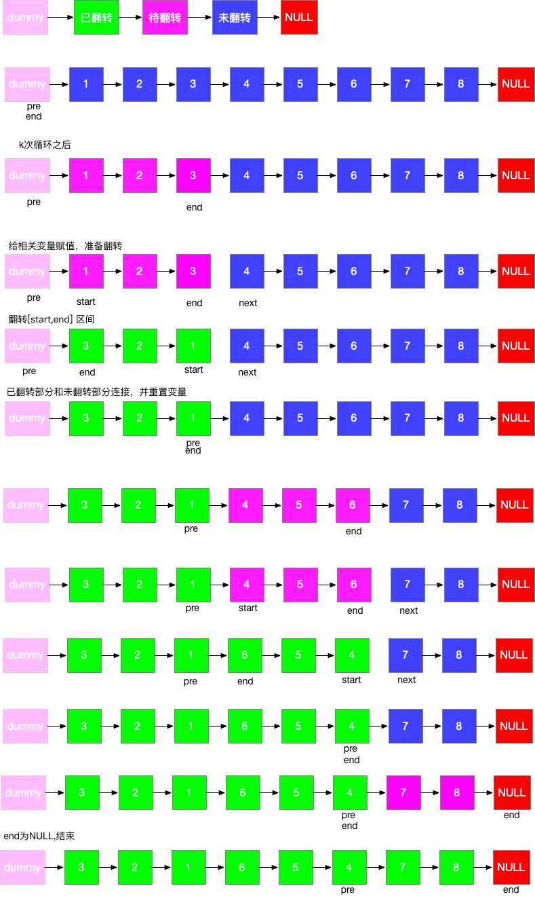

步骤分解:

- 链表分区为已翻转部分+待翻转部分+未翻转部分
- 每次翻转前，要确定翻转链表的范围，这个必须通过 k 此循环来确定
- 需记录翻转链表前驱和后继，方便翻转完成后把已翻转部分和未翻转部分连接起来
- 初始需要两个变量 pre 和 end，pre 代表待翻转链表的前驱，end 代表待翻转链表的末尾
- 经过k此循环，end 到达末尾，记录待翻转链表的后继 next = end.next
- 翻转链表，然后将三部分链表连接起来，然后重置 pre 和 end 指针，然后进入下一次循环
- 特殊情况，当翻转部分长度不足 k 时，在定位 end 完成后，end==null，已经到达末尾，说明题目已完成，直接返回即可
- 时间复杂度为 O(n*K)O(n∗K) 最好的情况为 O(n)O(n) 最差的情况未 O(n^2)O(n2)
- 空间复杂度为 O(1)O(1) 除了几个必须的节点指针外，我们并没有占用其他空间

